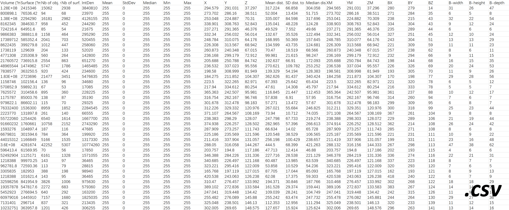
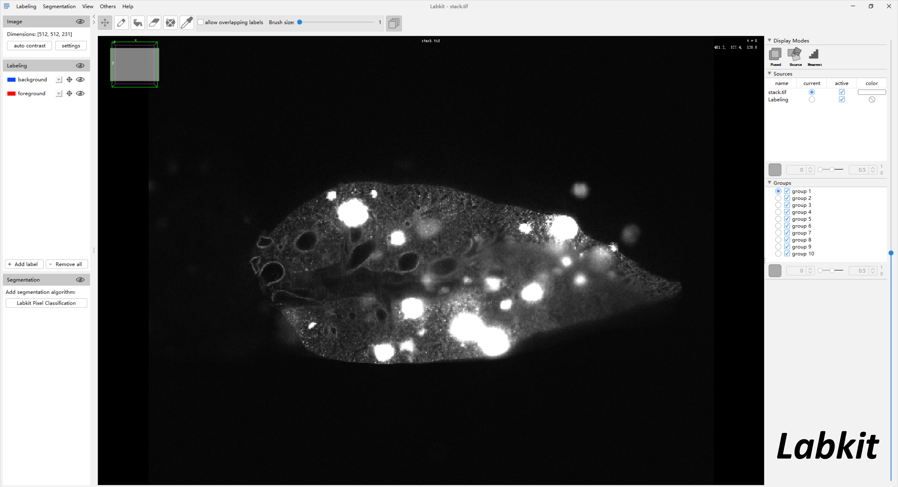
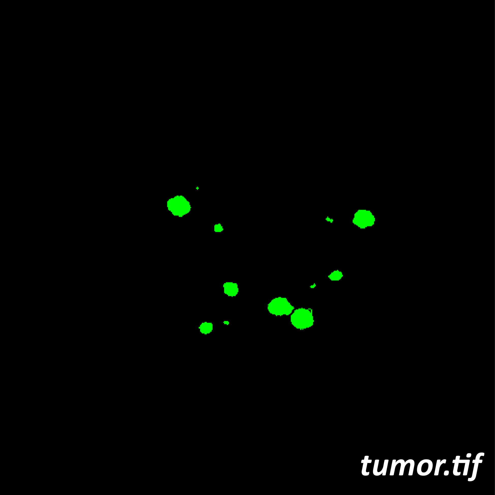
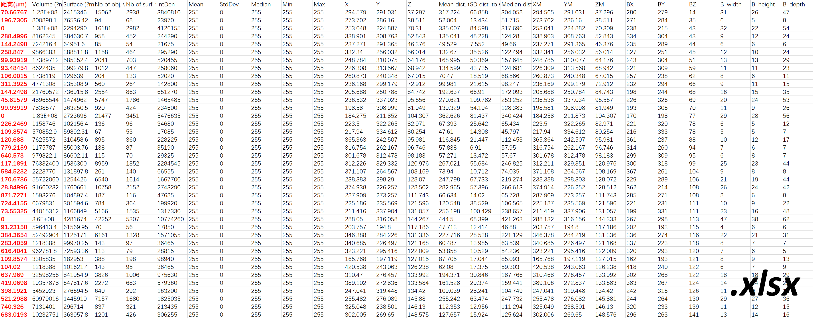

## Test Data
If you want to test our code, Please download the corresponding folder of the code, which contains our testdata. We have uploaded our test data to google drive, along with the ImageJ software that can run our code: **<https://drive.google.com/drive/folders/1nCuSpTXkkto2ZSKuN_eA7z6JRkfVCyiA?usp=sharing>**  
The example images in the following text are from: *"TestData\57-1_LKB1-10W-2(1.26X)-20221120\488-40ms-5um-1.26X-lobe1"*.

# TumorSegment   (ImageJ Macrocode)

The algorithm is used to segment tumors in the lung lobes of mice and obtain information about the number, size and location of tumors. Prior to this, our data had been simply preprocessed.

Usage: Run this code directly through ImageJ. After running, select the "TestData" folder in "Choose the parent directory", and the macro code will run automatically. The path format for the data needs to be the same as our "TumorSegment_testdata". The code automatically recognizes ***stack.tif*** in the subfolder for processing, ***stack_Merge_v5.tif*** is the processed image result, and the ***.csv*** file is the processed statistics result.

### Example images
  

# Surface_tumor   (Matlab)

The algorithm is used to analyze the distribution of tumors within the mouse lung lobes. Specifically, it calculates the shortest distance from each tumor to the surface of the lung lobe.

Usage:  
1、Segment the mouse lung lobe image to obtain the binary image ***lung_space.tif***. This process can be quickly and accurately completed using the *"Labkit"* plugin in ImageJ.  
 *GUI of the Labkit plugin.*  
2、It is usually necessary to run the **img_processing.m** program to optimize the segmented mask, resulting in ***lung_space_improve.tif***.  
3、Extract the tumor segmentation channel (green channel) from the ***stack_Merge_v5.tif*** image generated by **TumorSegment.ijm** and save it as the ***tumor.tif*** image.  
4、Use ***lung_space_improve.tif***, ***tumor.tif***, and the ***.csv*** statistical table as input to run the **surface_tumor.m** program. The program will generate a new XLSX file, where the distance information for each tumor will be automatically recorded in the first column of the table.

### Example images
   

# 3DResNet_tumor_classification   (Python)
The algorithm is primarily used for the automatic classification of tumors in mouse lung lobes. Based on the statistical results from the **TumorSegment.ijm** algorithm, we crop the original lung lobe images to obtain individual tumor images**(crop_tumor_LorR.m)**. After expert diagnosis, we obtained labels for nearly 2,000 tumors (AAH, AD, AC). Our algorithm is based on a 3D ResNet18 deep learning model, which achieves an accuracy of 93% on the test dataset.

