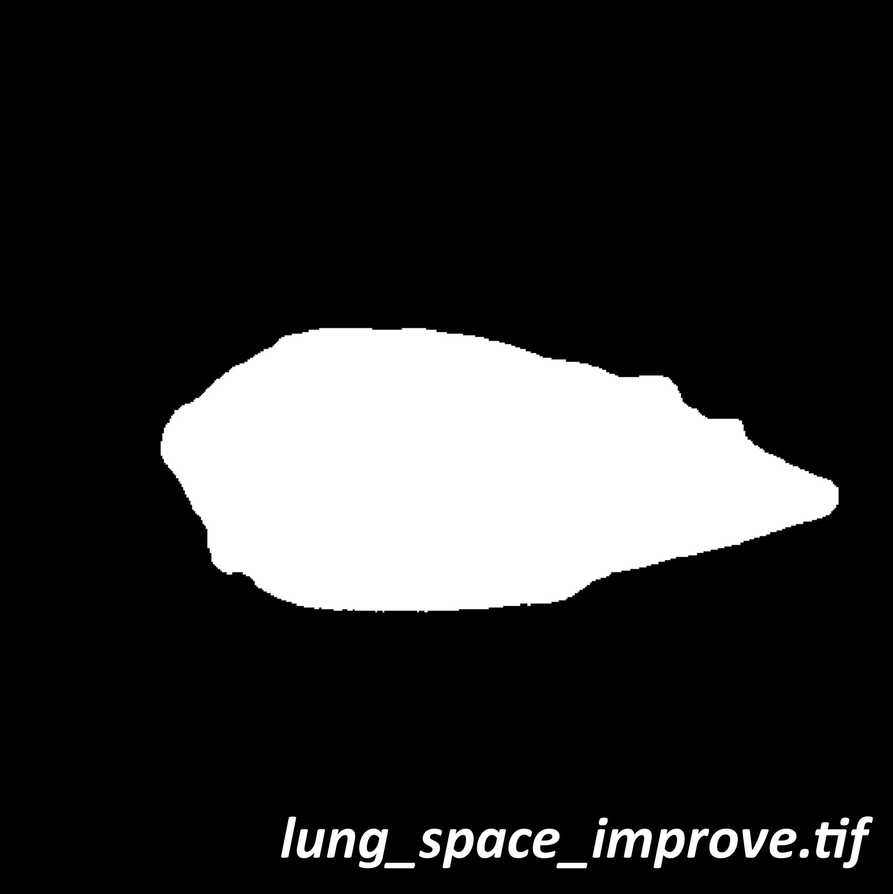
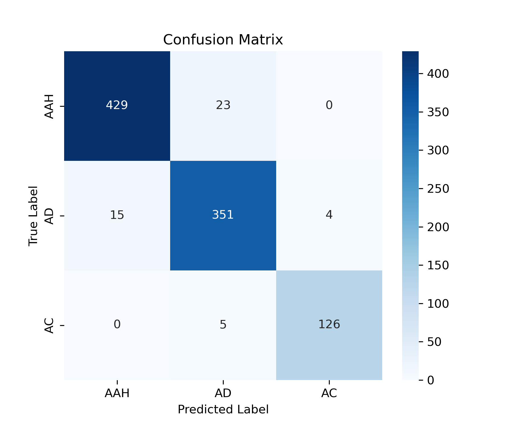

## Test Data
If you want to test our code, Please download the corresponding folder of the code, which contains our testdata. We have uploaded our test data to google drive, along with the ImageJ software that can run our code: **<https://drive.google.com/drive/folders/1nCuSpTXkkto2ZSKuN_eA7z6JRkfVCyiA?usp=sharing>**  
The example images in the following text are from: "TestData\57-1_LKB1-10W-2(1.26X)-20221120\488-40ms-5um-1.26X-lobe1". We only show a single frame from the 3D image.

# TumorSegment   (ImageJ Macrocode)

### Flowchart

The algorithm is used to segment tumors in the lung lobes of mice and obtain information about the number, size and location of tumors. Prior to this, our data had been simply preprocessed.

### Usage:
Run this code directly through ImageJ. After running, select the "TestData" folder in "Choose the parent directory", and the macro code will run automatically. The path format for the data needs to be the same as our "TumorSegment_testdata". The code automatically recognizes ***stack.tif*** in the subfolder for processing, ***stack_Merge_v5.tif*** is the processed image result, and the ***.csv*** file is the processed statistics result.

### Example images

  

# Surface_tumor   (Matlab)

### Flowchart

The algorithm is used to analyze the distribution of tumors within the mouse lung lobes. Specifically, it calculates the shortest distance from each tumor to the surface of the lung lobe.

### Usage:
1、Segment the mouse lung lobe image to obtain the binary image ***lung_space.tif***. This process can be quickly and accurately completed using the *"Labkit"* plugin in ImageJ.  

2、It is usually necessary to run the **img_processing.m** program to optimize the segmented mask, resulting in ***lung_space_improve.tif***.  
3、Extract the tumor segmentation channel (green channel) from the ***stack_Merge_v5.tif*** image generated by **TumorSegment.ijm** and save it as the ***tumor.tif*** image.  
4、Use ***lung_space_improve.tif***, ***tumor.tif***, and the ***.csv*** statistical table as input to run the **surface_tumor.m** program. The program will generate a new XLSX file, where the distance information for each tumor will be automatically recorded in the first column of the table.

### Example images

   

# ResNet3D_tumor_classification   (Python)

### Network Architecture

The algorithm is primarily used for the automatic classification of tumors in mouse lung lobes. We classify the tumors into three types: atypical adenomatous hyperplasia (AAH), adenoma (AD), and adenocarcinoma (AC). Our algorithm is based on a 3D ResNet18 deep learning model. Building upon this, we additionally introduced a simple fully connected layer to extract the raw size information of the tumor images. We merged this size information with the feature maps extracted by ResNet and input them together into the classification head at the backend for final classification, resulting in improved classification performance.

The model is trained using Python 3.9.21 and PyTorch 1.21.1 in the PyCharm IDE. We use a single RTX 3090 GPU for efficient computation, with the training duration typically under half an hour. The model can predict at a speed of approximately hundreds of tumors per second (excluding data loading time).

### Data Acquisition
Based on the statistical results from the **TumorSegment.ijm** algorithm, we crop the original lung lobe images to obtain individual tumor images(**crop_tumor_LorR.m**). To ensure the model's generalization, we randomly selected 2,953 tumors from 45 different genotypes of mice for the dataset. All tumor labels were manually annotated by multiple tumor experts. We randomly selected 2,000 tumors (AAH:AD:AC = 5:4:1) and divided them into training and validation dataset in an 8:2 ratio. The remaining 953 tumors were used as the test dataset.

### Installation
Run the following code to install all dependencies: `conda env create -f environment.yml`

### Usage:
**"main.py"** is used to train the model, while **"predict_AAH_AD_AC.py"** is used for tumor classification.   
Due to the nature of the dataset and labels, we performed two binary classifications to accomplish the three-class task. First, we classify AAH versus AD/AC, and then we classify AD versus AC. Therefore, we provide two **".pth"** pre-trained parameter files.

### Performance analysis

 

